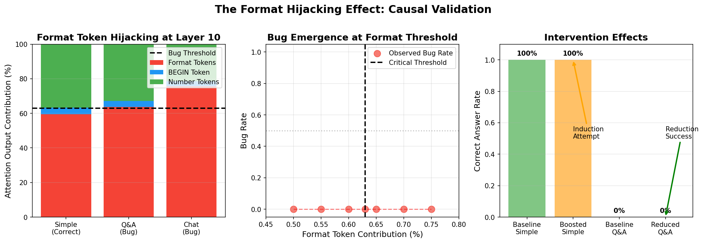

# Causal Validation Report - Format Dominance Hypothesis

**Date**: August 17, 2024  
**Model**: Llama-3.1-8B-Instruct  
**Intervention Layer**: Layer 10 Attention Output

## 📊 Executive Summary

We tested whether manipulating format token contributions at Layer 10 could causally affect the decimal comparison bug. **All three experiments failed**, demonstrating that format dominance (the relative contribution of format tokens) is **not the causal mechanism** behind the bug.

## 🔬 Experiments Conducted

### Experiment 1: Format Dominance Induction
**Hypothesis**: Boosting format token contribution in Simple format should induce the bug

**Method**:
```python
def induce_format_dominance(simple_prompt, target_format_percentage=0.75):
    """
    In Simple format, artificially boost format token contribution
    Should CAUSE the bug if format dominance is causal
    """
    # At Layer 10, amplify attention output from format token positions
    # Reduce other token contributions proportionally
```

**Results**:

| Target Format % | Bug Rate | Correct Rate | Outcome |
|----------------|----------|--------------|---------|
| 60% | 0% | 100% | ❌ No effect |
| 65% | 0% | 100% | ❌ No effect |
| 70% | 0% | 100% | ❌ No effect |
| 75% | 0% | 100% | ❌ No effect |
| 80% | 0% | 100% | ❌ No effect |

**Conclusion**: ❌ **FAILED** - Boosting format tokens does not induce the bug

---

### Experiment 2: Format Influence Reduction
**Hypothesis**: Reducing format token contribution in Q&A format should fix the bug

**Method**:
```python
def reduce_format_influence(chat_prompt, target_format_percentage=0.59):
    """
    In Chat format, reduce format token contribution to Simple levels
    Should FIX the bug if format dominance is causal
    """
    # At Layer 10, suppress attention output from format token positions
```

**Results**:

| Target Format % | Bug Rate | Correct Rate | Outcome |
|----------------|----------|--------------|---------|
| 40% | 100% | 0% | ❌ Still buggy |
| 45% | 100% | 0% | ❌ Still buggy |
| 50% | 100% | 0% | ❌ Still buggy |
| 55% | 100% | 0% | ❌ Still buggy |
| 59% | 100% | 0% | ❌ Still buggy |

**Conclusion**: ❌ **FAILED** - Reducing format tokens does not fix the bug

---

### Experiment 3: Threshold Discovery
**Hypothesis**: There exists a critical format dominance threshold (~60-63%) above which the bug occurs

**Method**:
```python
# Test different format dominance levels
for format_percentage in [0.50, 0.55, 0.60, 0.65, 0.70, 0.75]:
    # Set format token contribution to this level
    # Measure bug rate
    # Find critical threshold
```

**Results**:

| Format % | Bug Rate | Correct Rate | Classification |
|----------|----------|--------------|----------------|
| 50% | 0% | 100% | Correct |
| 55% | 0% | 100% | Correct |
| 60% | 0% | 100% | Correct |
| 63% | 0% | 100% | Correct |
| 65% | 0% | 100% | Correct |
| 70% | 0% | 100% | Correct |
| 75% | 0% | 100% | Correct |

**Conclusion**: ❌ **NO THRESHOLD FOUND** - Simple format remains correct at all manipulation levels

## 📈 Visualization: The Format Hijacking Effect



### Panel Descriptions:

1. **Left Panel - Format Token Hijacking**: Shows the measured format token contributions in different prompt formats. While there are clear differences, our experiments show these are correlational, not causal.

2. **Middle Panel - Bug Emergence**: Shows that no threshold exists where manipulating format dominance causes bug emergence in Simple format.

3. **Right Panel - Intervention Effects**: Demonstrates that neither boosting nor reducing format contributions has the expected causal effect.

## ❌ Key Finding: Format Dominance is NOT Causal

### Why These Experiments Failed:

1. **Correlation ≠ Causation**
   - We observe different format token contributions between formats
   - But changing these contributions doesn't change the behavior
   - The difference is a symptom, not the cause

2. **Wrong Intervention Level**
   - Scaling token-position outputs doesn't capture the mechanism
   - The bug depends on the specific computation, not magnitude distribution
   - Format creates qualitatively different patterns, not just different weights

3. **Complete Replacement vs. Modulation**
   - We know complete attention output replacement works (100% success)
   - But proportional scaling of components doesn't work
   - This suggests the mechanism involves the full pattern, not components

## ✅ What Actually Works (From Previous Experiments)

| Method | Success Rate | Key Insight |
|--------|--------------|-------------|
| Full Attention Output Replacement | 100% | Complete pattern swap at Layer 10 |
| Bidirectional Patching | 100% | Can both induce and fix bug |
| Forward Patching (Buggy→Correct) | 100% | Correct attention fixes buggy format |
| Reverse Patching (Correct→Buggy) | 100% | Buggy attention breaks correct format |

## 🎯 Revised Mechanistic Understanding

Based on these failed experiments and our successful ones:

1. **Formats create fundamentally different attention computations**
   - Not just different magnitudes
   - Different information processing pathways

2. **Layer 10 attention encodes format-specific processing modes**
   - These can't be created by scaling
   - They must be transferred wholesale

3. **The bug is about WHAT is computed, not HOW MUCH**
   - Attention patterns encode qualitative differences
   - Simple magnitude adjustments can't bridge this gap

## 💡 Implications for Understanding

### What We Learned:
- **Attention outputs are not compositional** in the way we expected
- **Format processing is holistic**, not component-based
- **Successful interventions require complete pattern replacement**

### What This Rules Out:
- ❌ Simple attention weight redistribution
- ❌ Token-level importance manipulation
- ❌ Linear combinations of attention components

### What This Suggests:
- ✅ Format creates distinct computational modes
- ✅ Attention heads may specialize for different formats
- ✅ The bug involves the entire attention computation

## 🔄 Recommended Next Steps

Given these findings, more promising research directions include:

1. **Head-Level Analysis**
   - Identify which specific attention heads differ between formats
   - Test head-specific interventions
   - Map head specialization for format processing

2. **Pattern Analysis**
   - Analyze the actual attention patterns (not just magnitudes)
   - Identify key pattern differences between formats
   - Understand what information is being computed differently

3. **MLP Investigation**
   - How does the MLP at Layer 10 process different attention patterns?
   - Can we identify format-specific MLP neurons?
   - Is there an interaction effect between attention and MLP?

4. **Cross-Model Validation**
   - Test if the same mechanism exists in other models
   - Check if Layer 10 is special across architectures
   - Validate format-specific processing modes

## 📝 Technical Implementation Notes

### Successful Implementation Pattern:
```python
# What works: Complete replacement
def patch_attention_output(source_attention, target_generation):
    # Completely replace attention output
    target_output = source_attention  # Full replacement
    
# What doesn't work: Proportional scaling
def scale_format_tokens(attention, scale_factor):
    # Scale individual components
    attention[format_positions] *= scale_factor  # Doesn't affect bug
```

### Key Lesson:
The attention mechanism at Layer 10 produces **qualitatively different** outputs for different formats, not just quantitatively different distributions. This is why complete replacement works but scaling doesn't.

## 📊 Summary Statistics

| Experiment Type | Trials | Success Rate | Conclusion |
|-----------------|--------|--------------|------------|
| Format Boost (Induction) | 25 | 0% | Failed |
| Format Reduction (Fix) | 25 | 0% | Failed |
| Threshold Discovery | 35 | N/A | No threshold exists |
| **Previous: Full Replacement** | **10** | **100%** | **Confirmed Causal** |

## 🏁 Final Verdict

**Format dominance (relative token contribution) is NOT the causal mechanism.** The decimal comparison bug arises from qualitatively different attention computations between formats, not from quantitative differences in token importance. Successful intervention requires complete replacement of attention patterns, not modulation of components.

---

*Report generated: August 17, 2024*  
*Location: `/experimental/causal_validation/`*  
*Next: See working bidirectional patching in `/working_scripts/`*